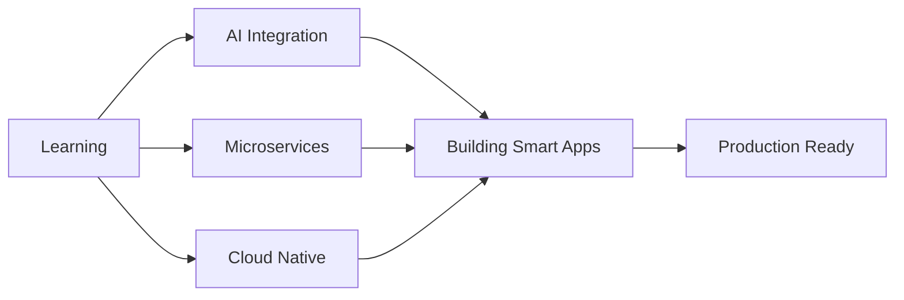

<div align="center">

# 👨‍💻 Mohamed Sayari

### `Software Engineer` • `Full-Stack Developer` • `AI Enthusiast`

[](https://www.linkedin.com/in/sayari-mohamed-991377257/)
[](mailto:sayari.mohamed@esprit.tn)
[](https://github.com/moh1920)


</div>

---

## 🎯 About Me

```typescript
const mohamed = {
    education: "Software Engineering @ ESPRIT",
    location: "Tunis, Tunisia 🇹🇳",
    currentFocus: ["Spring Boot", "Angular", "AI Integration", "DevOps"],
    learning: ["LLMs", "Microservices", "Cloud Architecture"],
    passion: "Creating intelligent, scalable applications",
    goal: "Master the intersection of AI + Software Engineering"
};
```

<div align="center">

### 🔥 Quick Highlights

| 🎓 Education | 💼 Experience | 🚀 Projects |
|:---:|:---:|:---:|
| Final Year @ ESPRIT | Full-Stack Development | 15+ Completed |
| Software Engineering | AI & Automation | Open Source Contributor |

</div>

---

## 💻 Tech Arsenal

<div align="center">

### Backend Development


### Frontend Development


### AI & Machine Learning


### DevOps & Tools


</div>

---

## 🚀 Featured Projects

<div align="center">

<table>
<tr>
<td width="50%">

### 🏨 Intelligent Hotel Platform
**Spring Boot • Angular • AI Chatbot**

🔹 Dynamic reservation system  
🔹 Stripe payment integration  
🔹 Keycloak authentication  
🔹 AI-powered assistant  

</td>
<td width="50%">

### ⚡ ElectroMap
**EV Charging Management**

🔹 Real-time station tracking  
🔹 Smart routing algorithms  
🔹 Leaflet map integration  
🔹 Notification system  

</td>
</tr>
<tr>
<td width="50%">

### 🤖 AI Chatbot with RAG
**Python • LangChain • Ollama**

🔹 Multi-intent detection  
🔹 Context-aware responses  
🔹 API integration  
🔹 Document retrieval  

</td>
<td width="50%">

### 🔐 Microservices Architecture
**Spring Cloud • Docker • K8s**

🔹 Service discovery  
🔹 API Gateway  
🔹 Load balancing  
🔹 Distributed tracing  

</td>
</tr>
</table>

</div>

---

## 📊 GitHub Analytics

<div align="center">
  
  
</div>

<div align="center">
  
  
</div>

---

## 🏆 GitHub Trophies

<div align="center">
  
</div>

---

## 📈 Contribution Activity

<div align="center">
  
</div>

---

## 💡 Current Focus



---

## 🌐 Connect & Collaborate

<div align="center">

[](https://www.linkedin.com/in/sayari-mohamed-991377257/)
[](mailto:sayari.mohamed@esprit.tn)
[](https://github.com/moh1920)

### 💬 Let's build something amazing together!

</div>

---

<div align="center">

### ⭐ From [Mohamed Sayari](https://github.com/moh1920)

**"Building Smart Systems with Clean Code, Strong Architecture & Powerful AI"**


</div>
